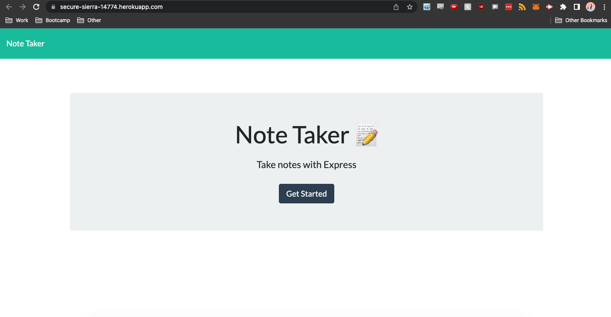
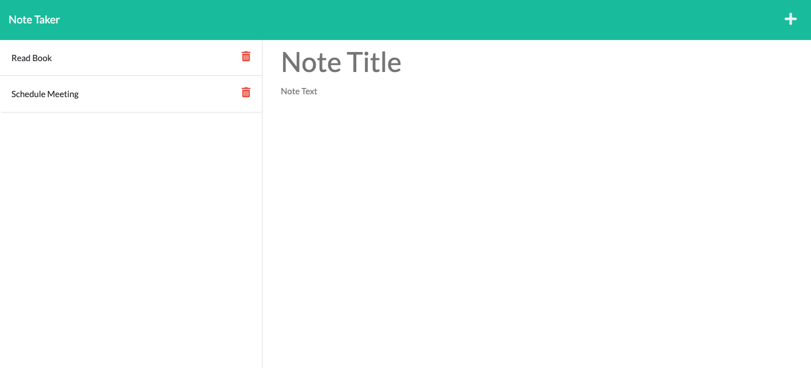
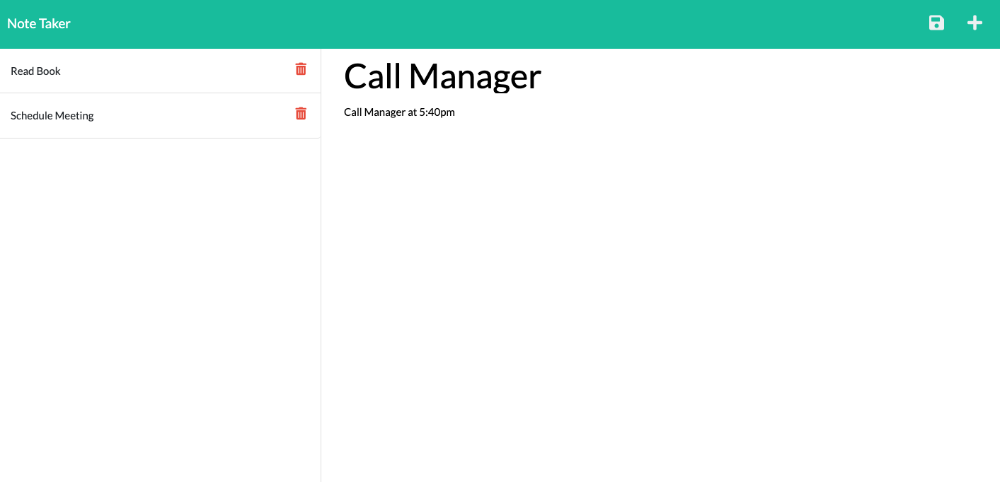
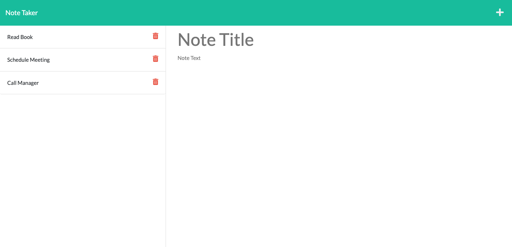

# 11 Express.js: Note Taker

## Your Task

For this task, starter code was provided and the task was to create an application called Note Taker that can be used to write and save notes. This application will use an Express.js back end and will save and retrieve note data from a JSON file.

## User Story

```
AS A small business owner
I WANT to be able to write and save notes
SO THAT I can organize my thoughts and keep track of tasks I need to complete
```


## Acceptance Criteria

```
GIVEN a note-taking application
WHEN I open the Note Taker
THEN I am presented with a landing page with a link to a notes page
WHEN I click on the link to the notes page
THEN I am presented with a page with existing notes listed in the left-hand column, plus empty fields to enter a new note title and the note’s text in the right-hand column
WHEN I enter a new note title and the note’s text
THEN a Save icon appears in the navigation at the top of the page
WHEN I click on the Save icon
THEN the new note I have entered is saved and appears in the left-hand column with the other existing notes
WHEN I click on an existing note in the list in the left-hand column
THEN that note appears in the right-hand column
WHEN I click on the Write icon in the navigation at the top of the page
THEN I am presented with empty fields to enter a new note title and the note’s text in the right-hand column
```


## Mock-Up

The following images show the web application's appearance and functionality:









## How It Works

* A user will fill out both the Note Title and Note Text fields, according to what note they would like to save.
* Once the note field are filled out, the user will be able to click the save icon in the top right hand corner to save the note for later.
* If the user wants to view an old note, they simply need to click that note on the left had side and the note will show up on the right hand side.
* If a new note wants to be added, the "+" sign can be click on in the upper right hand corner to do so.

## Languages
 
* HTML
* CSS
* JavaScript

## Website & Repository

* Github: https://github.com/anthonypacella/NoteTaker
* Deployed Website: https://secure-sierra-14774.herokuapp.com/
